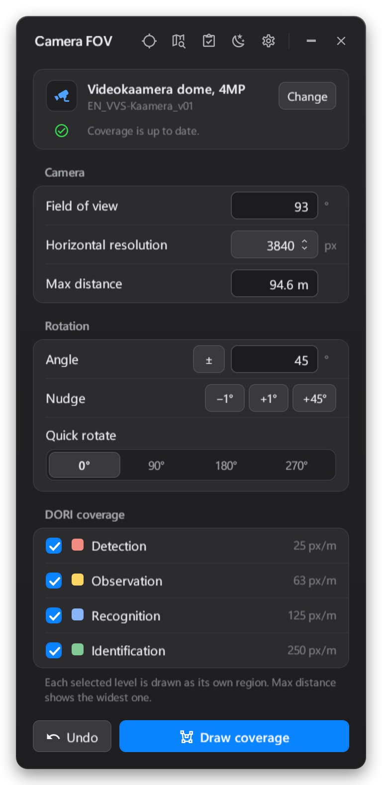
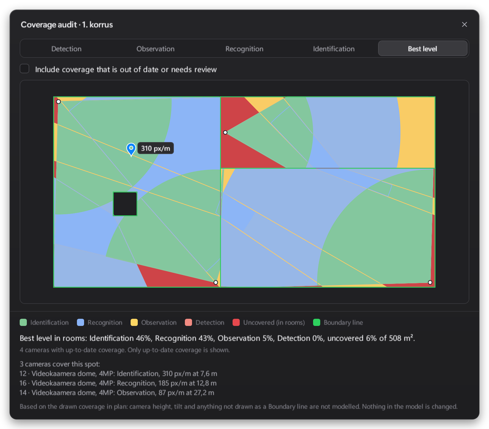
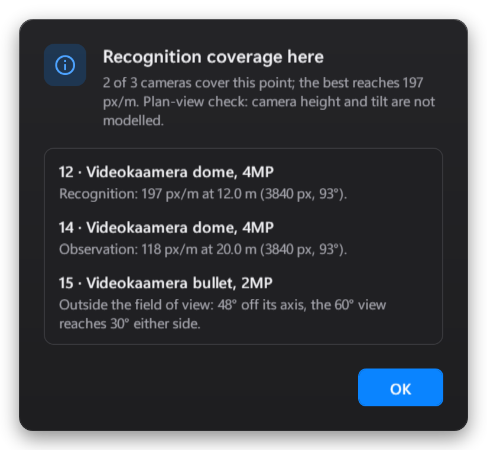
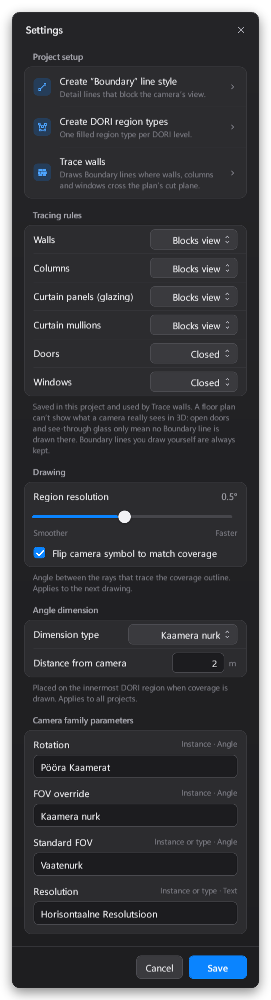

# Camera FOV for Revit

Draw what your security cameras can see, straight onto your Revit floor plans.

Camera FOV turns a camera family into coverage areas for the four DORI levels (Detection, Observation, Recognition, Identification). Walls, columns, doors and windows cut the view where they block it. When the design changes, the plugin tells you which cameras need redrawing.

  

## What you can do

- **Draw coverage.** Pick a camera, tick the DORI levels you need and press **Draw coverage**. Each level becomes its own coloured area, and the field-of-view angle is dimensioned for you.
- **Let walls block the view.** **Trace walls** turns the walls, columns, doors and windows at the plan's cut height into boundary lines, including those in linked models. You can also draw boundary lines yourself.
- **Keep drawings up to date.** Move or rotate a camera and the plugin shows that its coverage is out of date. Press **Update** to redraw it.
- **Check a spot.** Click a point in the plan to see which cameras cover it, how many pixels per metre each gives, and why the others don't.
- **Audit a whole floor.** See gaps and overlaps of all cameras at once, per DORI level, against the rooms on that floor.

  

## Install

1. Download **CameraFOV_Installer.exe** from the [Releases](https://github.com/RaulKalev/Camera-FOV/releases) page.
2. Run it. It finds Revit 2024 and 2026 by itself.
3. Start Revit. The plugin is on the **RK Tools** tab.

## Getting started

1. Open a floor plan.
2. Open **Settings** (the gear icon) and create the **Boundary** line style and the **DORI region types**. You only need to do this once per project.
3. Press **Trace walls** in Settings to turn the walls into boundary lines.
4. In the main window, press **Select** and click a camera in the plan.
5. Check the field of view, resolution and rotation, tick the DORI levels, and press **Draw coverage**.

Scroll the mouse wheel to zoom in the audit, hold it down to pan, and double-click it to zoom out.

## Your camera family

The plugin works with families in the **Security Devices** category. It reads these parameters when they exist. You can rename them in Settings to match your own families.

| Parameter | What it's for |
| :--- | :--- |
| **Vaatenurk** | The camera's field of view angle |
| **Horisontaalne Resolutsioon** | Horizontal resolution in pixels, e.g. `3840` |
| **Pööra Kaamerat** | Rotation of the camera (optional) |
| **Kaamera nurk** | A field of view that overrides the standard one (optional) |

If a family has none of these, type the field of view and pick the resolution in the window instead.

## Camera types

The camera icon in the main window opens **Camera types**, a library of the camera models you use: resolution, sensor size, focal length, the horizontal and vertical field of view ranges, and any custom parameters you add. **Work out field of view** fills the ranges from the sensor and focal length.

- **Share it.** Choose a shared folder (a network drive or a synced OneDrive/SharePoint folder) with **Change** at the bottom of the window, and everyone uses the same library. Each camera type is its own file. If someone else saved a camera type after you opened it, you're asked whether to keep yours or load theirs. Deleted types are moved to a `deleted` folder, so they can be restored.
- **Make Revit types from it.** Pick a camera family and press **Create Revit type**. The plugin duplicates a type of that family under the camera type's name and writes the resolution, the widest field of view and your custom parameters to the type parameters with the same names. If one of these parameters is missing from the family, you're told which.
- **Stay within the lens.** A camera of such a type can only be set within its horizontal range in the main window. A fixed lens can't be changed at all.

## More screenshots

  
  

## Good to know

- Everything is calculated on the floor plan. Camera height and tilt aren't taken into account yet.
- The plugin only changes what it drew itself. Filled regions and boundary lines you drew by hand are kept.
- Pixel density and DORI distances follow EVS-EN IEC 62676-4:2026 (Figure 4): horizontal pixels over the flat scene width, 2 × distance × tan(FOV / 2). The earlier formula, which matches Axis Site Designer and gives longer distances for wide lenses, can be chosen in Settings. Coverage drawn with the other formula is shown as out of date.
- Works in **Revit 2024** and **Revit 2026**.

## License

MIT. See [LICENSE](LICENSE).
